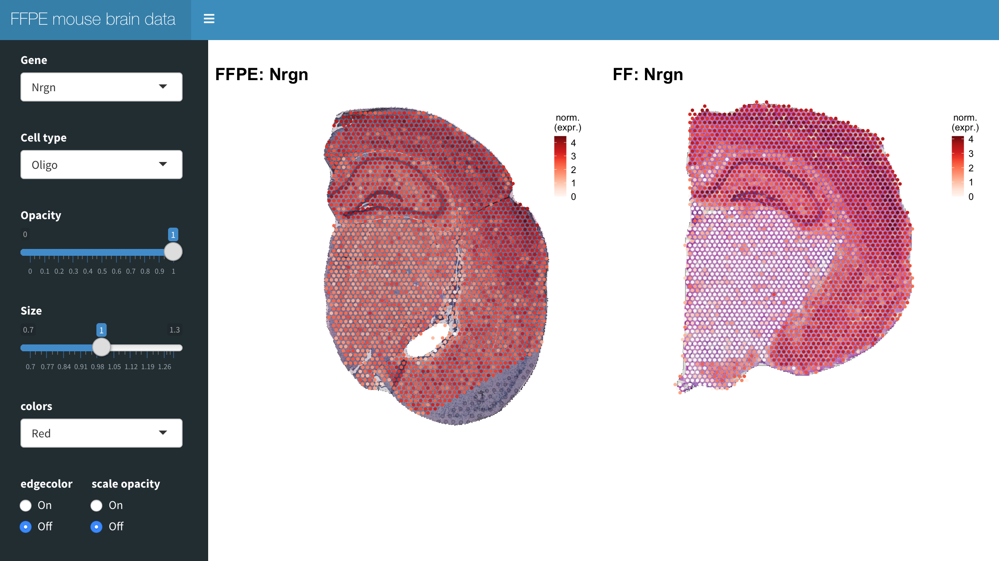

# FFPE mousebrain spatial transcriptomics data explorer
With this app you can explore spatial transcriptomics data of coronal sections from mouse brain tissue presented in "Genome-wide Spatial Expression Profiling in Formalin-fixed Tissues" (Villacampa E. and Larsson. L et al).

# Installation
Clone the repo from the terminal by running:

`$git clone https://github.com/ludvigla/FFPE_mousebrain_explorer`

To run the app, you first need to install the following R packages:
- ggplot2
- magrittr
- magick
- zeallot
- shiny
- shinydashboard
- RColorBrewer
- viridis
- scales

You can install the packages directly with the install-packages.R script:

`$Rscript install-packages.R`

# Run the app
From RStudio, navigate to the cloned repository:

`setwd("~/FFPE_mousebrain_explorer")`

You can then activate the app by running:

`library(shiny)`

`runApp()`

Or alternatively you can open the app.R file File->Open file->.../app.R and then click on the Run App at the top of the script.

# How to use
When you open the app, there are two H&E images of mouse brain tissue sections overlaid by spots. The left section was collected from FFPE tissue and the right section was collected from fresh frozen (FF) tissue. 

Spots are colored either by normalized expression or cell type proportions. You can visualize either data type by selecting a gene or a cell type in the top left panel. 

Options:
  * opacity : sets the spot opacity to control transparanecy
  * size : adjust spot size
  * colors : select colorscale
  * edgecolor : adds a border around each spot
  * scale opacity : apply a transparency scaling of the spots which is proportional to the values being visualized (low value = high transparency, high value = opaque)
  

